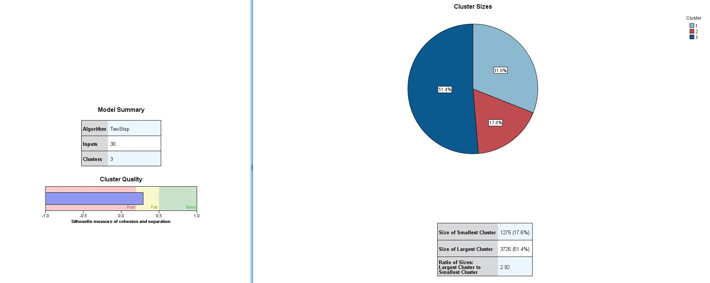

# 
 SESA-Risk Model Project Documentation 

## Introduction
The objective of this project was to segment SESA's AutoConectado clients using car telemetry data. 

**About AutoConectado**

AutoConectado is an insurance product of a project developed by IBM Ecuador for the insurance company Seguros Equinoccial (SESA). This project consists of recording, storing, processing and analyzing car telemetry data to gain insights.   

## Summary of the project

## 1. Sample Selection
There are 3 Jupyter notebooks explaining the procedure of extraction, pre-processing and aggregations of the data:

* [TRIP FACTS VS](https://github.com/raquelvargas16/modelo-sesa/blob/master/1%20TRIP%20FACTS%20VS.ipynb)
* [TRIP FACTS Geografía](https://github.com/raquelvargas16/modelo-sesa/blob/master/2%20TRIP%20FACTS%20Geografia.ipynb)
* [DEVICE FACTS con Var. Geo. FINAL](https://github.com/raquelvargas16/modelo-sesa/blob/master/3%20DEVICE%20FACTS%20con%20Var.%20Geo.%20FINAL.ipynb)

The feature engineering process is summarized in the following image.

Contitions to ensure data integrity:
  * At least 90 days since the installation of the device
  * At least 90 days of driving
  * Observed defective devices were excluded 

## 2. Descriptive Analysis

The Jupyter Notebook explaining the methodology used to reduce the number of categories in geographic variables using Correspondence Analysis is called: [MCA para variables geográficas](https://github.com/raquelvargas16/modelo-sesa/blob/master/MCA%20para%20variables%20geogr%C3%A1ficas.ipynb)

 I did a Principal Component Analysis to see the correlations between features. The results of the PCA were 16 principal components out of 110 features, this results are in the excel file "Rotated_Component_Matrix.xlsx". From this analysis, 44 features were selected with the client for the first clustering attempt. 

Afterward, I ran a Two-Step clustering analysis and the model with best cohesion and separation measures had three clusters and 30 features. The results are shown in the image below.

## 3. Data Segmentation

The methodology used for the data segmentation part and the classification model was proposed and supervised by SESA's head actuary. 

The software used to segment the devices data was performed using the Two-Step Cluster algorithm of SPSS Statistics.

The clustering part was accomplished using Principal Component Analysis for dimensionality reduction and applying the Two-Step Cluster algorithm into 3 levels of segmentation. This process is summarized in the image below.

Results of the first level of segmentation are presented below.

## 4. Classification model

The classification model was developed with 10 decision trees, one for each segmentation step as shown in the diagram above.

The data was balanced using SMOTE algorithm from `ibmlearn` library. The metrics used to check the trees accuracy were the F1-Score and confusion matrices. 

The final accuracy of the model is shown in the image below. 

## 5. Deployment of the classification model
The classification model, composed of 10 decision trees, was deployed in a repository of GitLab.

## 6.  Development of control panels for the model
The control panels are interactive tools to monitor the model and act if the data changes and a change in the model is need.

There are two main controls: input data controls and output data controls.

### Input data
The input data for the model is controlled by examining their distribution and variation each moth with a window of one year (12 months).

### Output data
The output data, i.e. the classification, is controlled by examining the 27 variables used in the trees of the classification model and the classification from this model.

The control panels are in a R Shiny app, the code of the first version of this app is in the folder [Shiny_test](modelo-sesa/Shiny_test/).

The following images are screenshots of the Shiny App.

## 7. Solution automatization
The process of automatization is summarized in the following scheme

## 8. Evolution

This project is in continuous evolution and first next steps are the following:
1.	Optimization of the data extraction and aggregation process.
2.	Development of a dashboard with insights for managers
3.	Deployment of the Shiny app in a container
